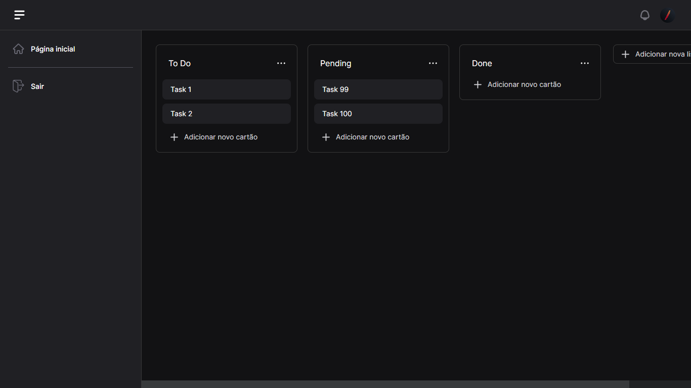

# Kanban board v1.0

The kanban board is in version 1.0, all the main features are working, such as: creating lists, deleting, moving cards and editing them, here we will see an introduction to how our kanban board code works.

### Modal Documentation

Understand how each modal works, such as: adding, editing and paying the card, etc.

[Click here](./modal-documentation.md)

## Folder structure

- **/src**
  - **/components**
    - **Kanban**
      - **Modals**
      - **Buttons**
      - **KanbanRoot.vue**

### Kanban folder

In the kanban folder we will have the Modais folder where there are components that add lists, delete them and the same with cards.

The KanbanRoot file is the
root file for its general functioning, where the logic for moving the cards is located, where it receives data from firebase and updates it automatically when any change occurs.

